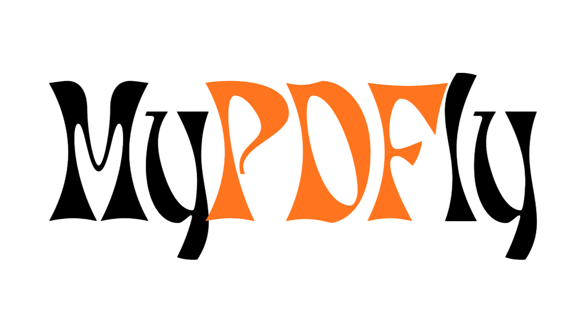

# mypdfly

<p align="center">
  
</p>

<p align="center">
  Editor PDF privado, rápido y completamente ejecutado en el navegador.
</p>

<p align="center">
  <a href="https://github.com/JhairAlexby/mypdfly/blob/main/LICENSE">
    
  </a>
  <a href="https://github.com/JhairAlexby/mypdfly">
    
  </a>
</p>

## ¿Qué es mypdfly?

mypdfly es una aplicación web para visualizar, editar, combinar y descargar documentos PDF sin subirlos a un servidor. El procesamiento ocurre localmente en el navegador para que el usuario conserve el control de sus archivos.

## Funcionalidades

- Subir y visualizar archivos PDF directamente en el navegador.
- Agregar y editar texto con tamaño, color, tipografía, negrita, cursiva y subrayado.
- Dibujar rectángulos, círculos, triángulos y líneas.
- Ajustar color, opacidad, grosor y posición de las formas.
- Difuminar secciones del documento y ajustar la intensidad del efecto.
- Crear firmas dibujadas con mouse, touchpad, lápiz o pantalla táctil.
- Combinar varios PDF y reorganizar sus páginas.
- Descargar el documento editado como PDF, PNG o JPEG; las exportaciones de varias páginas se agrupan en un ZIP.
- Editar en pantalla completa.
- Mantener el procesamiento de los documentos en el dispositivo del usuario.

## Tecnologías

- React 19 y TypeScript.
- Vite.
- Tailwind CSS y componentes de [shadcn/ui](https://ui.shadcn.com/).
- [PDF.js](https://mozilla.github.io/pdf.js/) para visualizar documentos.
- [pdf-lib](https://pdf-lib.js.org/) para generar el PDF descargable.
- [fflate](https://github.com/101arrowz/fflate) para empaquetar imágenes multipágina en ZIP.
- pnpm como gestor de paquetes.

## Puesta en marcha

### Requisitos

- Node.js 20 o superior.
- pnpm.

### Instalación

```bash
pnpm install
```

### Desarrollo

```bash
pnpm dev
```

Después, abre la URL local que muestre Vite en la terminal.

### Compilación y vista previa

```bash
pnpm build
pnpm preview
```

### Scripts disponibles

| Comando | Descripción |
| --- | --- |
| `pnpm dev` | Inicia el servidor de desarrollo con HMR. |
| `pnpm build` | Comprueba TypeScript y genera la versión de producción. |
| `pnpm lint` | Ejecuta ESLint sobre el proyecto. |
| `pnpm test` | Ejecuta las pruebas visuales, de orden, codificación PNG/JPEG y ZIP. |
| `pnpm preview` | Sirve localmente la compilación de producción. |

## Privacidad

mypdfly está diseñado con un enfoque local-first: los PDF seleccionados y sus ediciones permanecen en la sesión del navegador. No se necesita una cuenta ni un servicio de subida para utilizar el editor.

## Contribuir

Las mejoras, correcciones y nuevas ideas son bienvenidas. Puedes abrir un issue o enviar un pull request en el [repositorio de GitHub](https://github.com/JhairAlexby/mypdfly).

## Licencia

Este proyecto está disponible bajo la [Licencia MIT](./LICENSE). Puedes usarlo, copiarlo, modificarlo, distribuirlo y crear proyectos derivados, siempre que conserves el aviso de copyright y la licencia.

## Hecho por

<p align="center">
  <a href="https://mictlanlabs.com.mx" target="_blank" rel="noreferrer">
    
  </a>
</p>

<p align="center">
  Creado por <a href="https://github.com/JhairAlexby">JhairAlexby</a> · <a href="https://mictlanlabs.com.mx">MictlánLabs</a>
</p>
